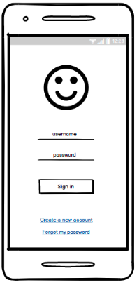
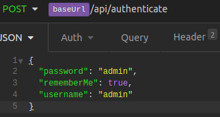
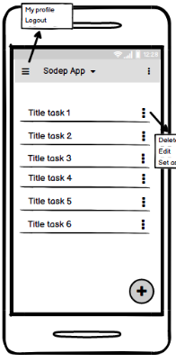
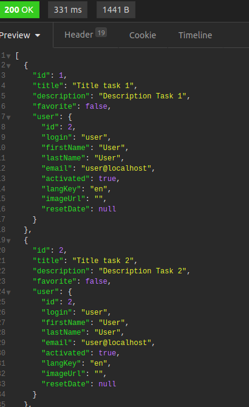
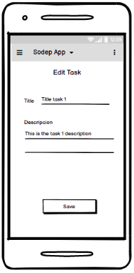

Ejercicio para evaluación de candidatos para Developers Android
===============================================================

Aplicación de administración de Tareas desarrollada para evaluar al Android Developer.

Descripción de la Evaluación
----------------------------
Se solicita la realización de una aplicación de administración de tareas siguiendo los lineamientos de los mockups proveídos para cada pantalla.
La aplicación base ya se encuentra en este repositorio.

Realizar la cantidad de pantallas que se puedan en el tiempo proveído para realizar el test.
Tener en cuenta que se prioriza la calidad del código, antes que la cantidad de pantallas realizadas  
La documentación cuenta con unos ejemplos de las llamadas y respuesta del API, sin embargo, la persona que te solicita el test, te proveerá la url de la documentación del API.

Pantalla 1 - Login
---------------------------------

El mockup muestra los lineamientos que seguir para construir esta pantalla, el servicio a consultar para hacer el Login es el siguiente:

Las consideraciones del diseño queda a cargo del desarrollador.

**Consideraciones**:

* Debe tener un logo.

* Debe tener 2 inputs, uno para usuario y otro para password. 

* Debe tener un botón de inicio de sesión.

Ejemplo de llamada y respuesta del API para autenticación:

Pantalla 2 - Listado de tareas
---------------------------------------------------------

Esta pantalla debe mostrar el listado de tareas proveídas por el API en el servicio

**Consideraciones**:

*     Debe mostrar el menu principal 
*     Mostrar el título de la aplicación
*     Debe mostrar el listado de tareas
*     Al costado derecho de cada tarea, debe tener opción para aplicar acciones (Editar/Eliminar). No son necesarias implementar estas acciones en este punto. 
*     Debe existir un botón para crear nuevas tareas.

Ejemplo de llamada y respuesta del API para listado de tareas:

Como se podrá observar, el access token va en un Header Authorization como Bearer token

Pantalla 3 - Creacion de tareas
---------------------------------------------------------

Esta pantalla posibilitará la creación de nuevas tareas por parte del usuario. Una vez creada la tarea, debe redirigir a la pantalla de listado de tareas.

**Consideraciones**:

*     Debe mostrar el menu principal
*     Debe tener un titulo "Crear Tarea"
*     Debe solicitar Titulo y Descrpcion de la tarea
*     Debe tener un boton de confirmacion de la operacion

Ejemplo de llamada y respuesta del API para creación de tareas:

También debe llevar el access token va en un Header Authorization como Bearer token

Pantalla 4 - Edicion de tareas
---------------------------------------------------------

Esta pantalla posibilitará la edición de tareas por parte del usuario.
Desde la lista de tareas, el usuario debe poder hacer un tap en una tarea en particular, y el mismo tiene que llevar a la pantalla de edición

**Consideraciones**:

*     Debe mostrar el menu principal
*     Debe tener un título "Editar Tarea"
*     Debe tener datos precargados de título y descripción de la tarea
*     Debe tener un botón de confirmación de la operación

Ejemplo de llamada y respuesta del API para listado de edición:

También debe llevar el access token va en un Header Authorization como Bearer token

Criterios de evaluación
-----------------------

1.  Correctitud de la solución

    Naturalmente, el proyecto entregado debe ser funncional y compilar. 
    También se va a evaluar *como* la solución presentada resuelve cada problema.
    
2.  Conocmiento de la plataforma Android

    ¿Tu código demuestra conocimiento de las capacidades de la plataforma Android y sus recursos?
    ¿Se supo qué librerias o anotaciones usar para cada caso?

3.  Coding style

    ¿Es bueno tu estilo de código? ¿Encaja con el código base proporcionado?
    ¿Es idiomático de tal forma en que va a ser fácilmente entendido por cualquier Android developer?
    ¿Está adecuadamente (pero no en exceso) documentado?
    
4.  Entendimiento de la especificación

    Se debería poder completar las tareas pedidas solamente leyendo la especificación en este repositorio.
    Las soluciones a las tareas deben ser de acuerdo a lo pedido en este README.
    
5.  Facilidad en probar la solución
    
    ¿Se provee todo lo necesario para ejecutar la solución entregada? 

Pasos iniciales
---------------

### Hacer un Fork del proyecto Github

Crear un propio fork con el usuario Github del developer.

### Clonar el proyecto a tu máquina

Probablemente estás leyendo esto en Github. Si no, puedes encontrar el proyecto [en GitHub](https://github.com/sodep/test-android-java)
Para empezar a trabajar, empieza por clonar el repositorio en tu máquina. Haz tu trabajo localmente y haz un commit de tus cambios a tu repositorio local git a medida que vayas avanzando.

### Documentación de la API a consumir

Se proveerá al developer la url de la documentación de la API a consumir.

Enviando tu código para evaluación
------------------------------------

Cuando termines y estés listo para enviar tu trabajo, haz un commit de tus últimos cambios y utiliza sube tus cambios al tu fork
Envía un email indicando la url de tu fork a la persona que te envió este test.
